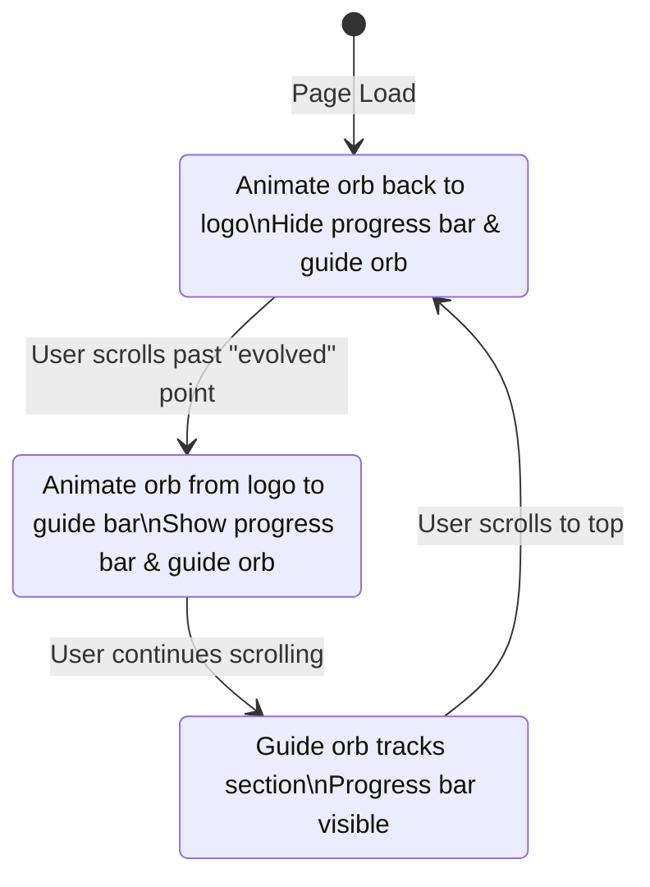

# Scroll-Triggered Orb & Progress Bar Animation Plan

## Objective

Create a whimsical, interactive scroll experience where:
- The leftside progress indicator bar and guide orb are hidden on initial page load.
- When the user scrolls past the "evolved" point, the orb animates out of the logo, follows a playful, spiraling path, and becomes the guide orb on the progress bar.
- The progress bar and guide orb appear, aligned with the central point of the logo's inner circle.
- As the user scrolls, the guide orb tracks the corresponding page section.
- If the user scrolls back to the top, the guide orb animates back to the logo and the progress bar hides.

---

## Implementation Steps

### 1. Initial State (Page Load)
- `#progressIndicator` and `#guide-orb` are hidden.
- The orb is visible inside the logo SVG (`#mini-orb`).

### 2. On Scroll Past Trigger Point
- When the user scrolls past the "evolved" point:
  - Show the progress bar and guide orb.
  - Animate the orb from the logo (`#mini-orb`) to the guide bar (`#guide-orb`) using a whimsical, spiraling path.
  - Change the original inner circle in the logo to standard purple.

### 3. While Scrolling
- The guide orb tracks the current section in the progress bar.
- The progress bar remains visible.

### 4. On Scroll Back to Top
- Animate the guide orb back to the logo, following a whimsical path.
- Hide the progress bar and guide orb.
- The orb reappears in the logo.

---

## Mermaid Diagram: Orb & Progress Bar State Flow

---

## Key Technical Notes

- **Scroll Detection:** Use scroll event listeners to detect when the "evolved" element enters the viewport.
- **Orb Animation:** Use JavaScript and CSS transitions/animations (or a JS animation library if needed) to animate the orb along a custom, whimsical path.
- **Visibility Control:** Toggle visibility of `#progressIndicator` and `#guide-orb` based on scroll position.
- **Alignment:** Dynamically position the guide orb to align with the logo's inner circle when it first appears.
- **Section Tracking:** Extend the existing progress bar logic to move the guide orb as the user scrolls through sections.

---

## Next Steps

1. Implement scroll detection and trigger logic.
2. Create the orb transition animation from logo to guide bar and back.
3. Integrate with the progress bar and section tracking.
4. Test and refine the whimsical, playful effect.